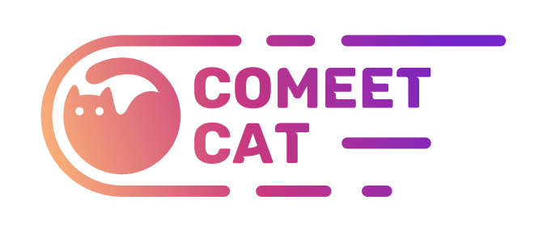

# Design System - Comeet Cat

Deploy: [Despegue!](https://hectordevx.github.io/comeet-cat__design-system/)

Design System del proyecto de Visualización de Asteroides Comeet Cat.

<kbd>

</kbd>

### Diseño UI 🎨

<kbd>

</kbd>

### Pre-requisitos 📋

- [ ] Node
- [ ] NPM

### Instalación 🔧

Instala el proyecto por medio de Git Clone o descargando el archivo Zip.

Una vez instalado no olvides enejutar:

```
npm install
```

## Despliegue 📦

Ejecuta el proyecto con:

```
npm start
```

## Construido con 🛠️

- [Figma](https://www.figma.com/) - Herramienta de Diseño y Prototipado
- [React](https://es.reactjs.org/) - Biblioteca Javascript
- [Styled Components](https://styled-components.com/) - Estilos para los componentes

## Diseño de Marca e Interfaz de usuario 🎨

- 🛠️ - Proyecto de Diseño

## Autores ✒️

- **Rafael Álvarez** - _Diseño y Desarrollo_ - [Rafael](https://github.com/soyraffaello)
- **Héctor Reyes** - _Diseño y Desarrollo_ - [HéctorDevx](https://github.com/HectorDevx)

## Licencia 📄

Este proyecto está bajo la Licencia (MIT).

## Gracias por tu atención 🎁

- Comenta a otros sobre este proyecto 📢
- Invitanos un taquito 🌮 o no olvides dejar una estrella ⭐.

🐱‍🚀

---

⌨️ con 💚 por [Rafael](https://github.com/soyraffaello) y [HéctorDevx](https://github.com/HectorDevx) 😊
